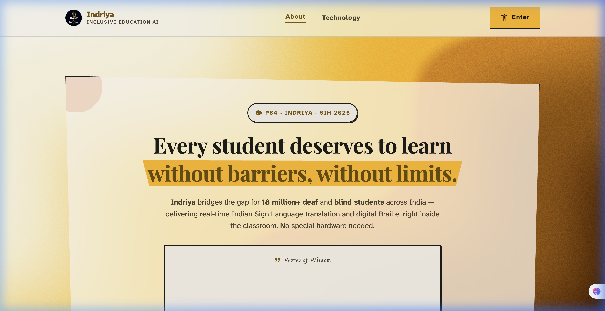
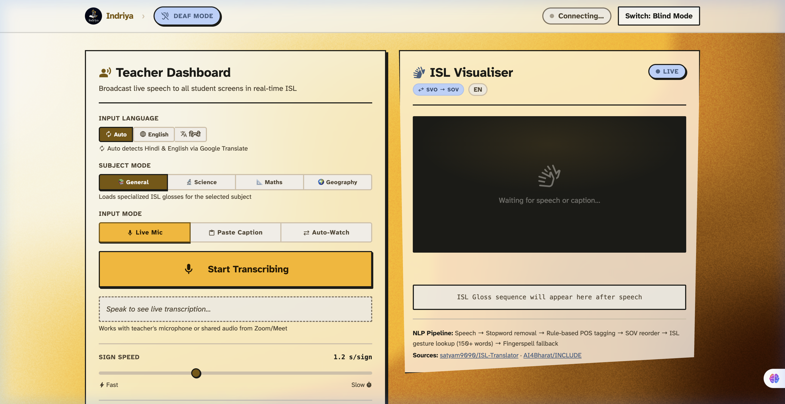
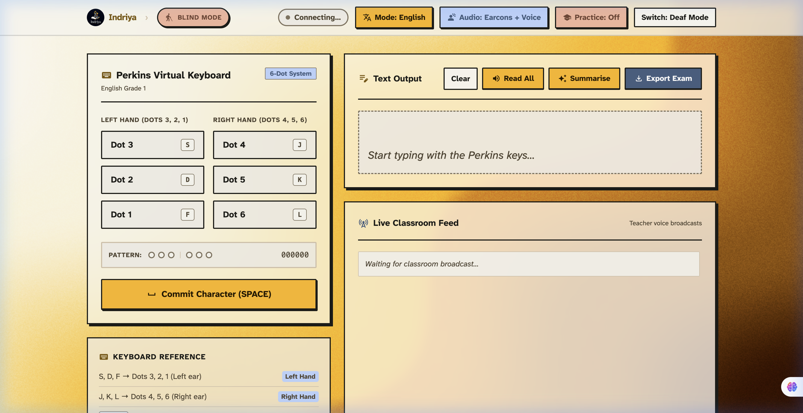
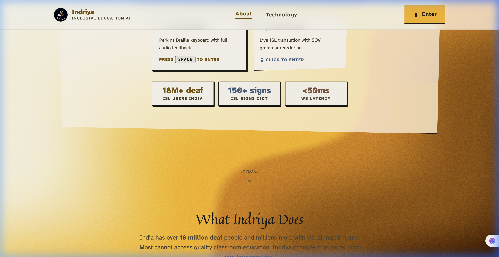
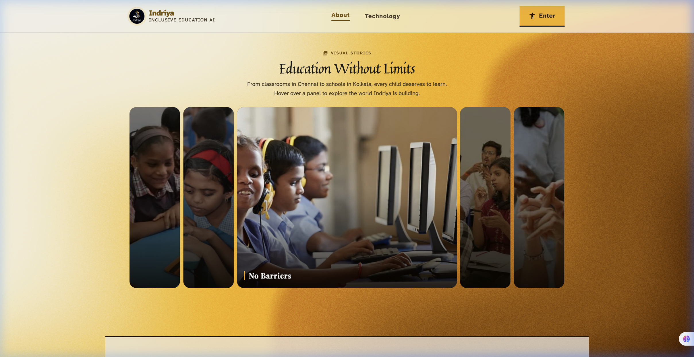

  
  
   

  
  
  *A unified platform empowering Deaf and Blind students in Indian classrooms.*
  
   

  
  
  
  

   
  
  

    
  

---

## 💡 The Problem

In a typical Indian classroom, educational infrastructure struggles to support sensory-impaired students:
- **Deaf students** miss out on vocal lectures because sign language interpreters aren't present. Existing tools focus on ASL (American Sign Language), ignoring the 18 million Deaf people in India who use **ISL (Indian Sign Language)**.
- **Blind students** can hear the lecture, but can't see board notes, slides, or type digital responses without expensive physical Braille displays. 

## 🚀 The Solution: Indriya

Indriya bridges these gaps through two powerful, browser-based environments that require **zero specialized hardware**.

---

## 🤝 Deaf Mode

A **live classroom broadcast system** that translates a teacher's spoken Hindi or English into grammatically correct Indian Sign Language (ISL) animations in real-time.

  

### ⭐ Key Features
- **ISL-First & Bilingual:** Translates code-switched Hindi/English into real ISL signs, using a curated dictionary of real human hand photos and GIFs (No "uncanny valley" 3D avatars).
- **Correct SOV Grammar:** Reorders English (Subject-Verb-Object) to ISL's natural grammar (Subject-Object-Verb).
- **Passive Broadcast Architecture:** The teacher speaks into a mic; the ISL animations instantly appear on every deaf student's screen via WebSockets.
- **Works with Zoom/Meet:** Supports multiple input modes including pasting live captions directly.

---

## 👁️ Blind Mode

A **native digital Braille environment** that allows blind students to take notes, hear board content, and interact with the classroom using just a standard laptop keyboard.

  

### ⭐ Key Features
- **Virtual Perkins Brailler:** Use `S-D-F` and `J-K-L` to type standard 6-dot Braille directly on any keyboard. No ₹45,000 hardware required!
- **Audio-First Design:** Complete TTS integration. Every key press and command produces clear auditory feedback and spatial audio cues.
- **Live Classroom Feed:** When the teacher types board notes, the text is broadcast to the blind student and read aloud instantly.
- **Bi-Directional Communication:** The student types in Braille, and the system translates it back to English text for the teacher to read.

---

## 🧠 AI / ML Strategy

Indriya leverages AI as an **invisible infrastructure** to make the experience seamless.
Highlights include:
- **Board OCR:** Point a phone camera at a blackboard, and Gemini Vision extracts handwriting to broadcast to both Deaf and Blind modes.
- **Two-Way Signing:** Uses **MediaPipe + XGBoost** to let deaf students sign back via webcam.
- **Sentence Simplification:** LLMs re-write complex academic jargon into simpler terms for higher ISL dictionary coverage.

  

---

## 🖼️ Education Without Limits

  

---

## 💻 Technology Stack

  

  
  
  
  

- **Frontend:** Vanilla HTML/JS, TailwindCSS, Web Speech API, `SpeechSynthesis` API.
- **Backend:** Python, FastAPI, WebSockets, Uvicorn.
- **ML Pipeline:** MediaPipe (hand landmark extraction) → OpenCV (frame processing) → XGBoost (ISL sign classifier).
- **AI / LLM:** Gemini Vision (Board OCR & sentence simplification).
- **Automation:** n8n (workflow orchestration for data pipelines).
- **Assets/CDN:** Supabase Storage (hosting 250+ ISL animation GIFs + Indriya logo).
- **Deployments:** Vercel (Frontend), Render (Backend).

---

 

  <i>Built with ❤️ for inclusive education in India — by the Indriya team.</i>

