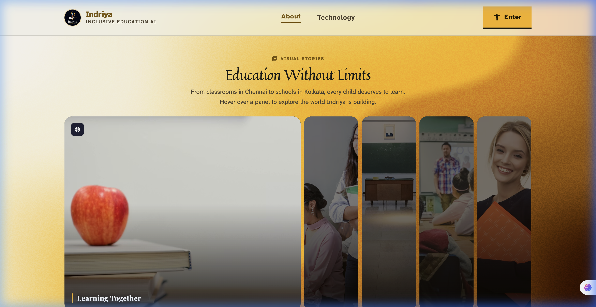

<div align="center">
  
  
  <br>

  [](https://git.io/typing-svg)
  
  *A unified platform empowering Deaf and Blind students in Indian classrooms.*
  
  <br>

  [](https://indriya-edu.vercel.app/)
  [](https://bharat-shakti-backend.onrender.com/)
  [](https://fastapi.tiangolo.com/)
  [](https://supabase.com/)

  <br>
  
  <p align="center">
    <a href="https://indriya-edu.vercel.app/">
      
    </a>
  </p>
</div>

---

##  The Problem

In a typical Indian classroom, educational infrastructure struggles to support sensory-impaired students:
- **Deaf students** miss out on vocal lectures because sign language interpreters aren't present. Existing tools focus on ASL (American Sign Language), ignoring the 18 million Deaf people in India who use **ISL (Indian Sign Language)**.
- **Blind students** can hear the lecture, but can't see board notes, slides, or type digital responses without expensive physical Braille displays. 

##  The Solution: Indriya

Indriya bridges these gaps through two powerful, browser-based environments that require **zero specialized hardware**.

<p align="center">
  
</p>

---

##  Deaf Mode

A **live classroom broadcast system** that translates a teacher's spoken Hindi or English into grammatically correct Indian Sign Language (ISL) animations in real-time.

<p align="center">
  
</p>

###  Key Features
- **ISL-First & Bilingual:** Translates code-switched Hindi/English into real ISL signs, using a curated dictionary of real human hand photos and GIFs (No "uncanny valley" 3D avatars).
- **Correct SOV Grammar:** Reorders English (Subject-Verb-Object) to ISL's natural grammar (Subject-Object-Verb).
- **Passive Broadcast Architecture:** The teacher speaks into a mic; the ISL animations instantly appear on every deaf student's screen via WebSockets.
- **Works with Zoom/Meet:** Supports multiple input modes including pasting live captions directly.

> **Read the deep-dive:** [Deaf Mode USPs & Roadmap (deaf.md)](deaf.md)

---

##  Blind Mode

A **native digital Braille environment** that allows blind students to take notes, hear board content, and interact with the classroom using just a standard laptop keyboard.

<p align="center">
  
</p>

###  Key Features
- **Virtual Perkins Brailler:** Use `S-D-F` and `J-K-L` to type standard 6-dot Braille directly on any keyboard. No ₹45,000 hardware required!
- **Audio-First Design:** Complete TTS integration. Every key press and command produces clear auditory feedback and spatial audio cues.
- **Live Classroom Feed:** When the teacher types board notes, the text is broadcast to the blind student and read aloud instantly.
- **Bi-Directional Communication:** The student types in Braille, and the system translates it back to English text for the teacher to read.

> **Read the deep-dive:** [Blind Mode Features & Roadmap (blind.md)](blind.md)

---

##  AI / ML Strategy

Indriya leverages AI as an **invisible infrastructure** to make the experience seamless.
Highlights include:
- **Board OCR:** Point a phone camera at a blackboard, and Gemini Vision extracts handwriting to broadcast to both Deaf and Blind modes.
- **Two-Way Signing:** Uses **MediaPipe + XGBoost** to let deaf students sign back via webcam.
- **Sentence Simplification:** LLMs re-write complex academic jargon into simpler terms for higher ISL dictionary coverage.

<p align="center">
  
</p>

> **Read the deep-dive:** [AI & ML Integration Strategy (ai.md)](ai.md)

---

##  Education Without Limits

<p align="center">
  
</p>

---

##  Technology Stack

<p align="center">
  <a href="https://skillicons.dev">
    
  </a>
</p>

- **Frontend:** Vanilla HTML/JS, TailwindCSS, Web Speech API, `SpeechSynthesis` API.
- **Backend:** Python, FastAPI, WebSockets, Uvicorn.
- **Assets/CDN:** Supabase Storage (hosting 250+ ISL animation GIFs + Indriya logo).
- **Deployments:** Vercel (Frontend), Render (Backend).

---

##  How to Run Locally

### 1. Backend Setup (FastAPI WebSocket Server)
```bash
cd backend
python -m venv venv
source venv/bin/activate  # On Windows: venv\Scripts\activate
pip install -r requirements.txt

# Run the WebSocket server
uvicorn main:app --reload --port 8000
```

### 2. Frontend Setup
```bash
cd frontend
# You can use any static server, e.g., Python's built-in server:
python -m http.server 3000
```
Open `http://localhost:3000` in your browser.

> **Note:** The frontend automatically checks if it's running on `localhost` to connect to `ws://localhost:8000`. When deployed, it defaults to the production Render WebSocket URL.

---

<br>

<div align="center">
  <i>Built with ❤️ for inclusive education in India — by the Indriya team.</i>
</div>
